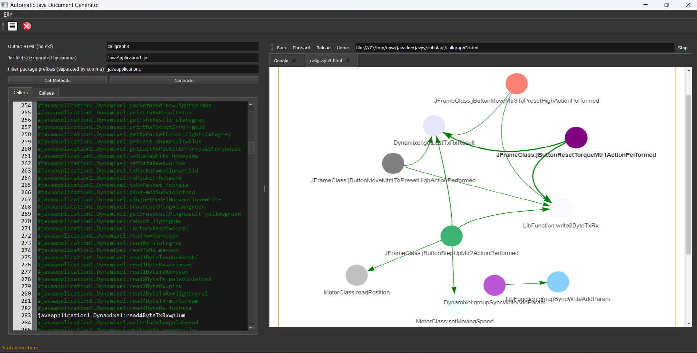

# Dokumen

Automatic Java document generator.

# Installation

```pip3 install -r requirements.txt```

# Run application

```python doku.py```

# Generating callgraph.jar
## Compile java project into callgraph.jar

(Please use appropriate commands (cp, mv) for your platform)

```
mvn package 
cp target\callgraph-0.1-SNAPSHOT-static.jar . 
mv -f callgraph-0.1-SNAPSHOT-static.jar callgraph.jar
```

# Todo

- Add PlantUML support
- Add javadoc support

# How to use

For now only method calls are illustrated. Soon others such as classes dependencies. 

- Put the jar file(s) of the applications that you want to illustrate in the root folder of dokumen. Put the name of the Jar file(s) (separated by comma if there are several) in the `'Jar file(s) (separated by comma)'` (second input field in the screenshow below `JavaApplication1.jar`)

- Put the package prefix (in this case `javaapplication1`) to filter only classes and methods from within those packages (to omit classes/methods from libraries)

- Press "Get methods" to randomly select 25 caller methods and 25 callee methods. If one of the callers calls one of the callees, then Graphs would be generated.

- Press "Generate" to show the graph




